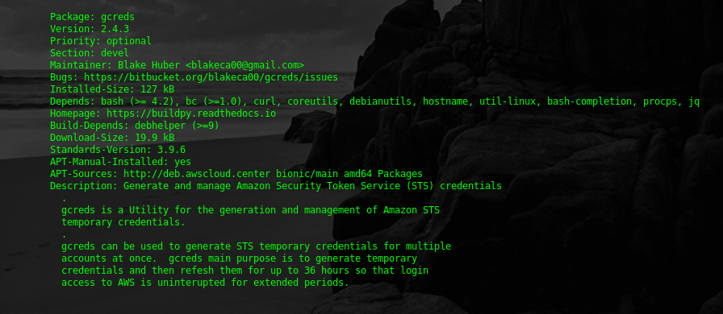

<a name="top"></a>
* * *
# gcreds
* * *

## Summary

**gcreds** (pronounced "gee-creds" for _generate credentials_) is a utility for creation and managment of IAM temporary access credentials using Amazon's [Security Token Service (STS)](https://docs.aws.amazon.com/STS/latest/APIReference/welcome.html).  [Temporary credentials](https://docs.aws.amazon.com/IAM/latest/UserGuide/id_credentials_temp.html) are used to access AWS resources when assuming a role identity.

For more information on the above terms and functions, see [an explanation of IAM roles in the Amazon Web Services](https://docs.aws.amazon.com/STS/latest/APIReference/API_AssumeRole.html) documentation.

**Version**:	2.4.6


* * *

## Contents

* [**Purpose**](#purpose)

* [**Dependencies**](#dependencies)

* [**Program Options**](#program-options)

* [**Build Options**](#build-options)

* [**Configuration**](#configuration)

* [**Installation**](#installation)
    * [Ubuntu, Linux Mint, Debian-based Distributions](#debian-distro-install)
    * [Redhat, CentOS](#redhat-distro-install)
    * [Amazon Linux 2, Fedora](#amzn2-distro-install)

* [**Generating STS Credentials**](#generating-sts-credentials)

* [**Auto Refresh Mode**](#auto-refresh-mode)

* [**Screenshots**](#screenshots)

* [**Author & Copyright**](#author--copyright)

* [**License**](#license)

* [**Disclaimer**](#disclaimer)

--

[back to the top](#top)

* * *

## Purpose ##

**gcreds** requests temporary credentials from [Amazon's Security Token Service (STS)](http://docs.aws.amazon.com/STS/latest/APIReference/Welcome.html) for roles that normally require [multi-factor credentials](https://en.wikipedia.org/wiki/Multi-factor_authentication) in order to authenticate.

A primary use case for **gcreds** is generating a temporary set of AWS access credentials for programmatic use by automation tools running on your local machine.

**gcreds** manages temporary credentials it generates to prevent corruption of your local awscli config. When generating new temporary credentials, **gcreds** will automatically clear expired credentials from your local awscli config to block the presence of duplicate sets of credentials.


#### Previous Releases ####
* [v2.0 Release Notes](./notes/release_v2.0.md)
* [v1.2 Release Notes](./notes/release_v1.2.md)
* [v1.0 Release Notes](./notes/release_v1.0.md)
* [v1.3 Release Notes](./notes/release_v1.3.md)

--

[back to the top](#top)

* * *

## Dependencies

[gcreds](https://github.com/fstab50/gcreds) requires the following:

- [Python version 3.6+](https://docs.python.org/3/)
- Installation Amazon CLI tools (awscli, see Installation section)
- [jq](https://stedolan.github.io/jq), a json parser generally available from your distribution repo
- bash (4.x)
- Standard linux utilities:
    * grep
    * awk
    * sed
    * cat
    * hostname

--

[back to the top](#top)

* * *

## Program Options

To display the **gcreds** help menu:

```bash
    $ gcreds --help
```

<p align="center">
    <a href="http://images.awspros.world/gcreds/help-menu.png" target="_blank">
</p>

--

[back to the top](#top)

* * *
## Build options

**[GNU Make](https://www.gnu.org/software/make) Targets**.  Type the following to display the available make targets from the root of the project:

```bash
    $  make help
```

<p align="center">
    <a href="http://images.awspros.world/gcreds/make-help.png" target="_blank">
</p>

--

[back to the top](#top)

* * *
## Configuration

Configure [gcreds](https://github.com/fstab50/gcreds) runtime options by entering the configuration menu:

```bash
    $ gcreds --configure
```

[](http://images.awspros.world/gcreds/configure-1.png)&nbsp;

--

If the same IAM user will be utilised to generate role credentials, set the default gcreds IAM user here to avoid entering "--profile <user>" every time gcreds is called to generate credentials for your local awscli configuration:

[](http://images.awspros.world/gcreds/configure-2.png)

--

Choose a default color scheme for gcreds accent highlighting via the next menu:

[](http://images.awspros.world/gcreds/configure-3.png)&nbsp;

--


[](http://images.awspros.world/gcreds/configure-4.png)

--

[back to the top](#top)

* * *
## Installation
* * *

<a name="debian-distro-install"></a>
### Ubuntu, Linux Mint, Debian variants  (Python 3.6+)

The easiest way to install **gcreds** on debian-based Linux distributions is via the debian-tools package repository:


1. Open a command line terminal.

    [](http://images.awspros.world/gcreds/deb-install-0.png)

2. Download and install the repository definition file

    ```
    $ sudo apt install wget
    ```

    ```
    $ wget http://awscloud.center/deb/debian-tools.list
    ```

    [](http://images.awspros.world/gcreds/deb-install-1.png)

    ```
    $ sudo chown 0:0 debian-tools.list && sudo mv debian-tools.list /etc/apt/sources.list.d/
    ```

3. Install the package repository public key on your local machine

    ```
    $ wget -qO - http://awscloud.center/keys/public.key | sudo apt-key add -
    ```

    [](http://images.awspros.world/gcreds/deb-install-2.png)

4. Update the local package repository cache

    ```
    $ sudo apt update
    ```

5. Install **gcreds** os package

    ```
    $ sudo apt install gcreds
    ```

    Answer "y":

    [](http://images.awspros.world/gcreds/deb-install-3.png)


6. Verify Installation

    ```
    $ apt show gcreds
    ```

    [](http://images.awspros.world/gcreds/deb-install-4.png)


[back to the top](#top)

* * *

<a name="redhat-distro-install"></a>
### Redhat, CentOS  (Python 3.6+)

The easiest way to install **gcreds** on redhat-based Linux distributions is via the developer-tools package repository:


1. Open a command line terminal.

    [](http://images.awspros.world/gcreds/rpm-install-0.png)

2. Install the official epel package repository

    ```
    $ sudo yum install epel-release
    ```

2. Download and install the repo definition file

    ```
    $ sudo yum install wget
    ```

    [](http://images.awspros.world/gcreds/rpm-install-1.png)

    ```
    $ wget http://awscloud.center/rpm/developer-tools.repo
    ```

    [](http://images.awspros.world/gcreds/rpm-install-2.png)

    ```
    $ sudo chown 0:0 developer-tools.repo && sudo mv developer-tools.repo /etc/yum.repos.d/
    ```

    [](http://images.awspros.world/gcreds/rpm-install-2b.png)


3. Delete the local repository cache, then Update the cache with new package references

    ```
    $ sudo rm -fr /var/cache/yum
    $ sudo yum update -y
    ```

4. Install the **gcreds** os package

    ```
    $ sudo yum install gcreds
    ```

    [](http://images.awspros.world/gcreds/rpm-install-3.png)


    Answer "y":

    [](http://images.awspros.world/gcreds/rpm-install-4.png)


5. Verify Installation

    ```
    $ yum info gcreds
    ```

    [](http://images.awspros.world/gcreds/rpm-install-5.png)


[back to the top](#top)

* * *
<a name="amzn2-distro-install"></a>
### Amazon Linux 2 / Fedora (Python 3.7+)

Redhat Package Manager (RPM) format used by Amazon Linux under development.  Check [amzn2.awscloud.center](http://s3.us-east-2.amazonaws.com/amzn2.awscloud.center/index.html) page for updates.

--

[back to the top](#top)

* * *

## Generating STS Credentials ##

#### Output when generating credentials

```bash
    $ gcreds --profile <iam_user> --accounts list.accounts --refresh-hours 4
```

<p align="left">
    <a href="http://images.awspros.world/gcreds/stdout.png">
</p>


#### Modifications to local awscli configuration (account ids have been obscured):

```bash
    $ less ./aws/credentials
```

<p align="left">
    <a href="http://images.awspros.world/gcreds/credentials.png">
</p>


#### Example Use of profiles created by **greds**:

<p align="left">
    <a href="http://images.awspros.world/gcreds/example-usage.png">
</p>


#### Log File

Coloration courtesy of [source-highlight](https://www.gnu.org/software/src-highlite).

```bash
    $ cat /var/log/gcreds.log
```

<p align="left">
    <a href="http://images.awspros.world/gcreds/log-output.png">
</p>


* * *

## Auto Refresh Mode ##

#### Automatic regeneration of temporary credentials

```bash
    $ gcreds --profile <iam_user> --accounts list.accounts --refresh-hours 4
```

#### Output during generation of credentials:

<p align="left">
    <a href="http://images.awspros.world/gcreds/auto-gen.png">
</p>

#### Authentication Status

Runtime statistics displayed while authenitcation is active.   Alternatively, the command below displays same information anytime.

```bash
    $ gcreds  --show
```

<p align="center">
    <a href="http://images.awspros.world/gcreds/gcreds-status.png">
</p>


[back to the top](#top)

* * *

## Screenshots

#### Green Accent Scheme

```bash
    $ gcreds  --help
```

<p align="center">
    <a href="http://images.awspros.world/gcreds/help-menu-green.png">
</p>


[back to the top](#top)

* * *

#### Blue Accent Scheme (green terminal)

<p align="right">
    <a href="http://images.awspros.world/gcreds/help-menu-blue.png">
</p>


[back to the top](#top)

* * *

## Author & Copyright

All works contained herein copyrighted via below author unless work is explicitly noted by an alternate author.

* Copyright Blake Huber, All Rights Reserved.

[back to the top](#top)

* * *

## License

* Software contained in this repo is licensed under the [license agreement](./LICENSE.md).  You may display the license and copyright information by issuing the following command:

```
$ gcreds --version
```

[](https://images.awspros.world/gcreds/version-copyright.png)


[back to the top](#top)

* * *

## Disclaimer

*Code is provided "as is". No liability is assumed by either the code's originating author nor this repo's owner for their use at AWS or any other facility. Furthermore, running function code at AWS may incur monetary charges; in some cases, charges may be substantial. Charges are the sole responsibility of the account holder executing code obtained from this library.*

Additional terms may be found in the complete [license agreement](./LICENSE.md).

[back to the top](#top)

* * *
