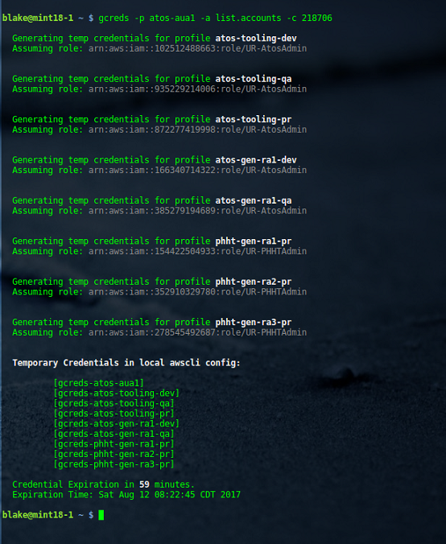
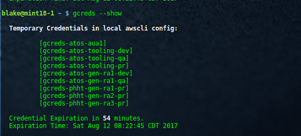

# README :  gcreds (v2.0)
* * *

## Purpose ##

**gcreds** (pronounced "gee-creds" for _generate credentials_) requests temporary credentials  
from [Amazon Security Token Service (STS)](http://docs.aws.amazon.com/STS/latest/APIReference/Welcome.html) for roles that normally require mfa  
credentials in order to authenticate.  

A primary use case for **gcreds** is generating a temporary set of AWS access  
credentials for programmatic use by automation tools running on your local machine.  

**gcreds** manages temporary credentials it generates to prevent corruption of your  
local awscli config. When generating new temporary credentials, **gcreds** will  
automatically clear expired credentials from your local awscli config to block  
the presence of duplicate sets of credentials.

See [v2.0 Release Notes](./notes/release_v2.0.md)

#### Previous Releases ####
* [v1.2 Release Notes](./notes/release_v1.2.md)
* [v1.0 Release Notes](./notes/release_v1.0.md)
* [v1.3 Release Notes](./notes/release_v1.3.md)

* * *

## Deployment Owner/ Author ##

Blake Huber  
Slack: [@blake](https://mpcaws.slack.com/team/blake)  

* * *

## Contents ##

* [README.md](./README.md):  This file
* [gcreds](./gcreds):  gcreds main executable
* [notes/](./notes/):  Directory containing all release notes

* * *

## Dependencies ##

- One of the following python versions: 2.6.5, 2.7.X+, 3.3.X+, 3.4.X+
- Installation Amazon CLI tools (awscli, see Installation section)
- [jq](https://stedolan.github.io/jq), a json parser generally available from your distribution repo
- bash (4.x)
- Standard linux utilities: grep, awk, sed, cat, hostname

* * *

## Usage ##

Help Menu

```bash
    $ ./gcreds -h  
```


* * *

## Installation - Redhat / Ubuntu ##

* Install jq, a JSON parser from your local distribution repository.

```bash
    $ sudo apt-get install jq    # Ubuntu, most Debian-based distributions
```
```bash
    $ sudo yum install jq        # RedHat, Fedora, CentOS
```

* Install [awscli](https://github.com/aws/aws-cli/)

    Detailed instructions can be found in the README located at:
    https://github.com/aws/aws-cli/

    The easiest method, provided your platform supports it, is via [pip](http://www.pip-installer.org/en/latest).

```bash
    $ sudo pip install awscli
```

* If you have the aws-cli installed and want to upgrade to the latest version you can run:

```bash
    $ sudo pip install --upgrade awscli
```

* Clone this git repo in a writeable directory:

```bash
    $ git clone <domain>/gcreds.git
```

* Add **gcreds** to your PATH in your shell profile (.bashrc OR .bash_profile)

```bash
    $  echo "export PATH=$PATH:$HOME/<gcreds dir>/gcreds" >> ~/.bashrc
```

* * *

## Installation - Cygwin (Windows 7) ##

Cygwin is a Unix-like environment and command-line interface for Microsoft Windows. Cygwin provides native integration of Windows-based applications, data, and other system resources with applications, software tools, and data of the Unix-like environment. Thus it is possible to launch Windows applications from the Cygwin environment, as well as to use Cygwin tools and applications within the Windows operating context.

#### Required steps to install and configure Cygwin:
1. Download Cygwin installer from official website https://www.cygwin.com/
2. Run installer

    -------------------------------------------
    

    -------------------------------------------

3. Choose Install from Internet option in Choose A Download Source
4. Select Root Install Directory, All Users option is recommended
5. Select Local Package Directory
6. Choose Use Internet Explorer Proxy Settings option
7. Select one of the mirrors
8. Select packages, required packages: python3, python3-pip, and git
    a. Change view to Full
    b. Type package name into Search field
    c. Click on New field in particular package that you would like to install, Bin? field has to have "X" icon

    

9. Run Cygwin64 Terminal
10. Run command:

        $ pip3 install awscli

11. clone this repository

        $ git clone <domain>/gcreds.git

12. Configure credentials and profiles in ~/.aws/credentials

        [IAMUSER1]
        aws_access_key_id=XXXXXXXXXXXXXXX
        aws_secret_access_key=xxxxxxxxxxxxxxxxxxxxxxxxxxxxxx
        mfa_serial = arn:aws:iam::0000000:mfa/IAMUSER1

        [tooling-dev]
        role_arn = arn:aws:iam::102512488663:role/Admin-ServiceRole
        source_profile = IAMUSER1
        mfa_serial = arn:aws:iam::0000000:mfa/IAMUSER1

        [development-qa]
        role_arn = arn:aws:iam::935229214006:role/S3-ServiceRole
        source_profile = IAMUSER1
        mfa_serial = arn:aws:iam::0000000:mfa/IAMUSER1

13. Create a file containing the profile names of the accounts in which you want  
to generate temporary credentials for roles

        $ vim myroles.profiles    # call this file anything you wish

        $ cat myroles.profiles

        tooling-dev
        tooling-qa
        development-qa

* * *

## Output ##

**stdout** - when generating credentials



**Modifications to local awscli configuration** (account ids have been obscured):  

```bash
    $ less ./aws/credentials
```  


**Example Use** of profiles created by **greds**:


**Log output** (colors courtesy of pkg [source-highlight](https://www.gnu.org/software/src-highlite/)):

```bash
    $ less ~/gcreds/logs/gcreds.log
```

  

* * *

## Options ##

**Auto Refresh** -- automatic regeneration of temporary credentials

```bash
    $ gcreds -p atos-aua1 -a list.accounts --auto 4
```

  

  

**Show Option** -- show current temporary credentials; associated lifetime

```bash
    $ gcreds --show
```

  

* * *

## Enhancement Roadmap ##

1. Upon startup, check the $AWS_SHARED_CREDENTIALS_FILE variable for an alternate location of the  
awscli credentials dir.  Set cred_path = value if found; else use default location (~/.aws).  
From a cli, see:
```bash
    $ aws help config-vars
```
