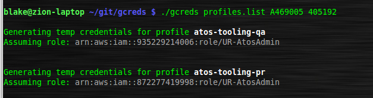

# README :  gcreds (v1.0)
* * *

## Purpose ##

**gcreds** requests temporary credentials from [Amazon Security Token Service (STS)](http://docs.aws.amazon.com/STS/latest/APIReference/Welcome.html)  
for roles that normally require mfa credentials in order to authenticate.  

The primary use case for **gcreds** is for generating a temporary set of AWS access  
credentials for programmatic use by an automation tools running on your local machine.

See [v1.0 Release Notes](./notes/release_v1.0.md)

* * * 

## Deployment Owner/ Author ##

Blake Huber  
Slack: [@blake](https://mpcaws.slack.com/team/blake)  

* * * 

## Contents ##

* [README.md](./README.md):  This file
* [gcreds](./gcreds):  gcreds main executable
* [notes/](./notes/):  Directory containing all release notes

* * * 

## Dependencies ##

- One of the following python versions: 2.6.5, 2.7.X+, 3.3.X+, 3.4.X+
- Installation Amazon CLI tools (awscli, see Installation section)
- jq | a json parser generally available from your distribution repo
- bash (4.x)

* * *

## Usage ##

Help Menu

```bash
    $ ./gcreds -h  
```


* * *

## Installation ##

* Install jq, a JSON parser from your local distribution repository.

```bash
    $ sudo apt-get install jq    # Ubuntu, most Debian-based distributions
```
```bash
    $ sudo yum install jq        # RedHat, Fedora, CentOS 
```

* Install [awscli](https://github.com/aws/aws-cli/)
    
    Detailed instructions can be found in the README located at:
    https://github.com/aws/aws-cli/

    The easiest method, provided your platform supports it, is via [pip](http://www.pip-installer.org/en/latest).

```bash
    $ sudo pip install awscli
```

* If you have the aws-cli installed and want to upgrade to the latest version you can run:

```bash
    $ sudo pip install --upgrade awscli
```

* Clone this git repo in a writeable directory:

```bash
    $ git clone <domain>/gcreds.git
```


* * *

## Output ##

Sample Output - generating credentials



Changes to local configuration for awscli:  

```bash
    $ less ./aws/credentials
```  

(**Note:** actual keys and account ids have been obscured)


* * * 

## Enhancement Roadmap ##

* temp credential expiration variable at runtime via user-provided parameter.
* Needs to validate that all profile names for which it is generating temp credentials  
have a corresponding entry and role_arn present in the local config.
* flag passed at runtime to suppress all stdout msgs, diverting instead to log only.
* run time parameter filtering to eleminate dep on given parameter order.